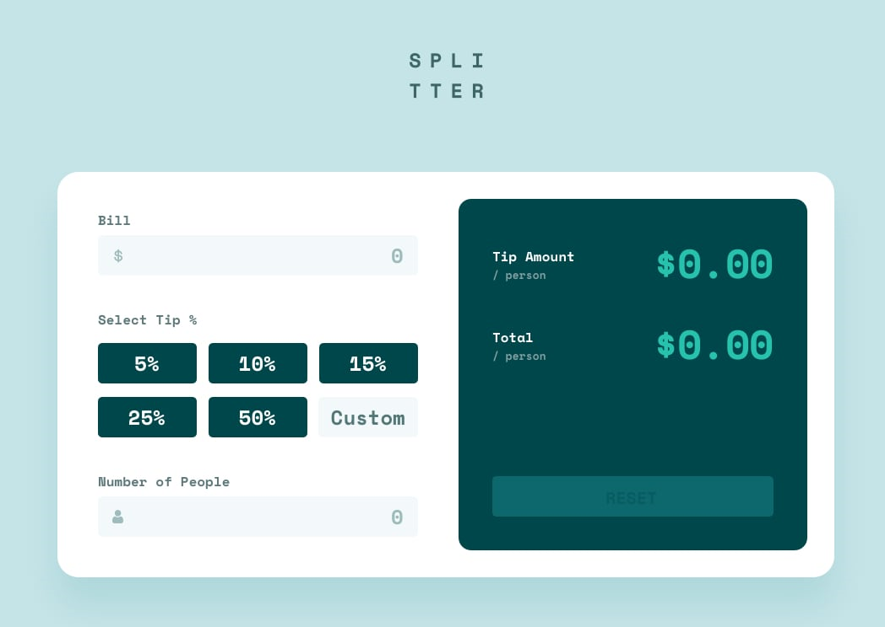

# Frontend Mentor - Tip calculator app

This is a solution to the [Tip calculator app challenge on Frontend Mentor](https://www.frontendmentor.io/challenges/tip-calculator-app-ugJNGbJUX). Frontend Mentor challenges help you improve your coding skills by building realistic projects.

 

## TECHNOLOGIES USED ⬇
- **Semantic HTML5 ⚙**
- **Tailwindcss** ⚡🌟
- **VanillaJS** 🚀

 

### **[Live Site](DevJhozi.github.io/tip-calc)**   🔗

 

## Author 👨‍💻

- **Joshua Timothy** - **[Linkedin](https://linkedin.com/in/rammcodes)**, **[Twitter](https://twitter.com/rammcodes)**, **[Github](https://github.com/rammcodes)**

 

## Give a Star ⭐

If you like this project then give it a **Github** star by pressing the **Star** button ⭐
